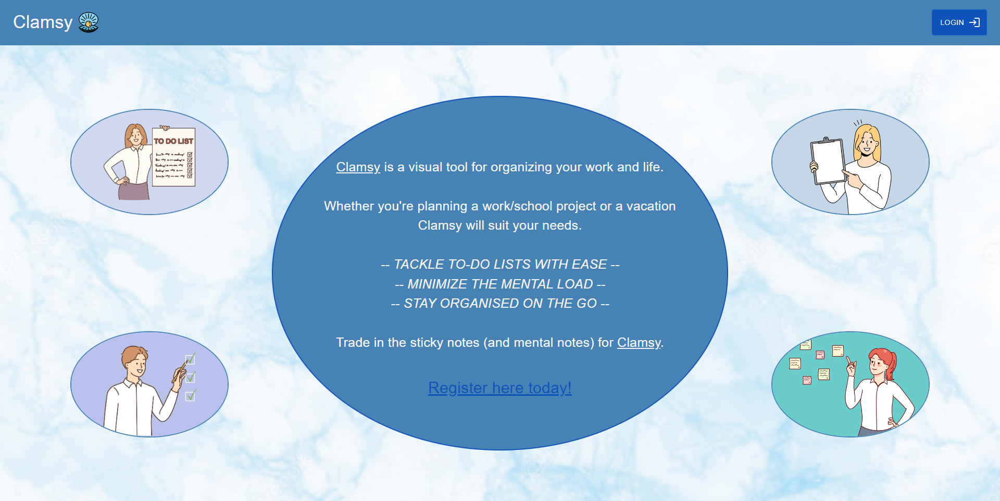
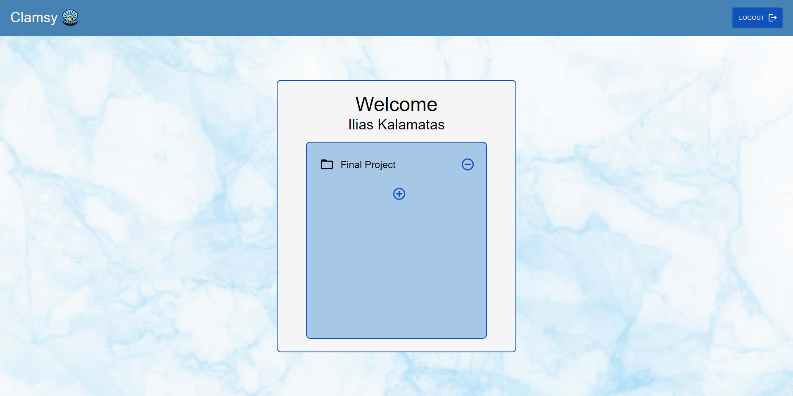
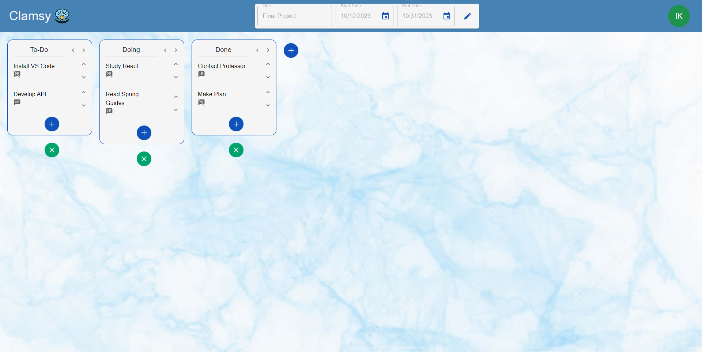
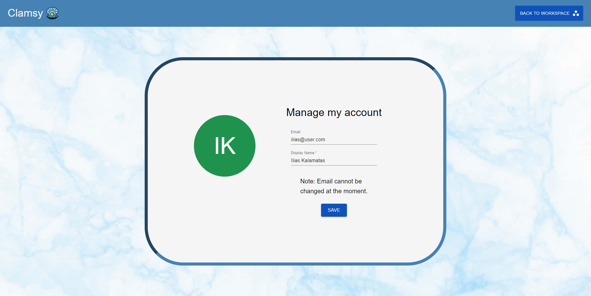

# Clamsy - Project Management Tool
Clamsy is a project management tool which I developed as the final project of Boolean UK Academy. A project management tool is a type of software that's designed to assist an individual or team in managing and organizing their projects and tasks.

## Technologies
The tool was developed using the technologies below:
- React
- Material UI
- Java
- Spring
- mySQL
- JPA & Hibernate

## Repositories
React App:   https://github.com/iliask796/final-project-react    
API:   https://github.com/iliask796/final-project-api

## Application Preview
Homepage
    
Workspace Manager
    
Workspace
    
Profile
    

### Presentation Link
https://prezi.com/p/fqjogemyhuv7/?present=1
